# Getting Started with JetBrains IntelliJ Language Server

Integrate the JetBrains IntelliJ Language Server into MCP ADE (Agent Development Environment) as an alternative to Eclipse JDT.LS for Java validation.

**Prerequisites**:
- MCP ADE (Agent Development Environment) server running (see [Getting Started](./getting-started.md))
- An MCP client (Claude Desktop, Claude Code, Bob IDE)

## Step 1: Install the VS Code Extension

1. Open **VS Code** > **Extensions** (`Ctrl+Shift+X`)
2. Search for **[Java and Kotlin by IntelliJ IDEA](https://marketplace.visualstudio.com/items?itemName=JetBrains.intellij-server)** by JetBrains
3. Click **Install**

> **Note**: VS Code is only needed to install the server binary. The language server runs independently via MCP ADE (Agent Development Environment).

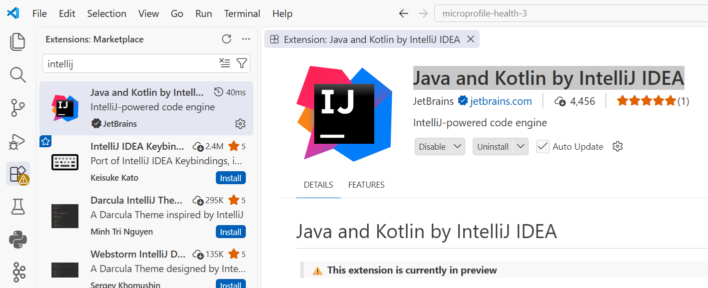

## Step 2: Open the Admin UI

After [starting the MCP ADE (Agent Development Environment) server](./getting-started.md#step-1-build--launch-mcp-ade), open **[http://localhost:7654/admin](http://localhost:7654/admin)** and click on the **Extensions** tab.

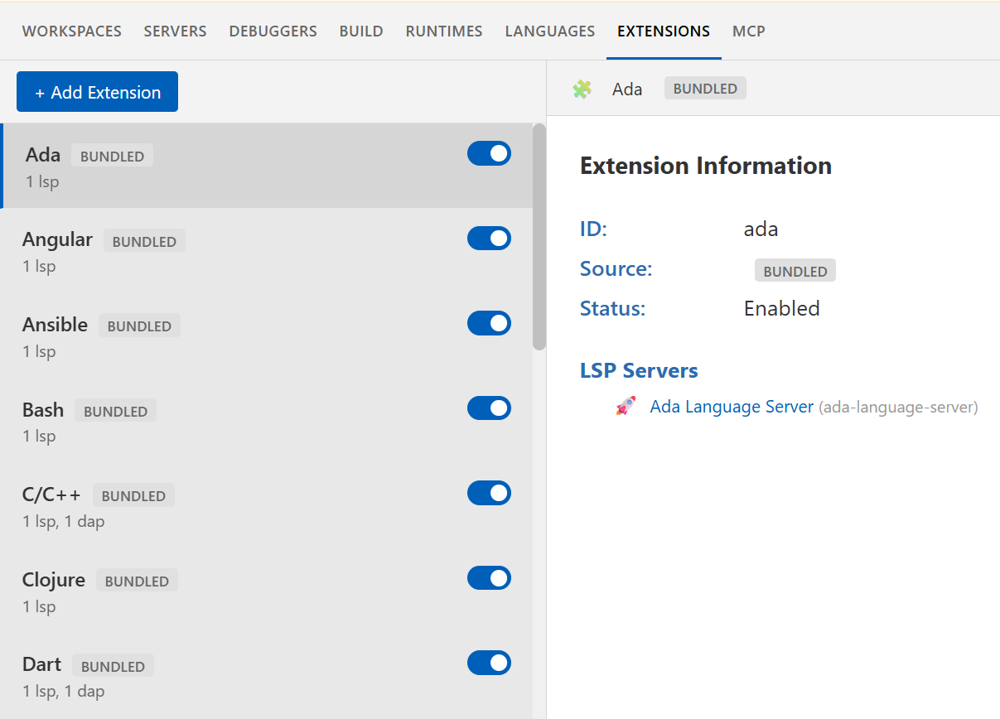

## Step 3: Add the IntelliJ Extension

1. Click **+ Add Extension**
2. Select **Import Method**: **JSON**
3. Enter **Extension ID**: `intellij`

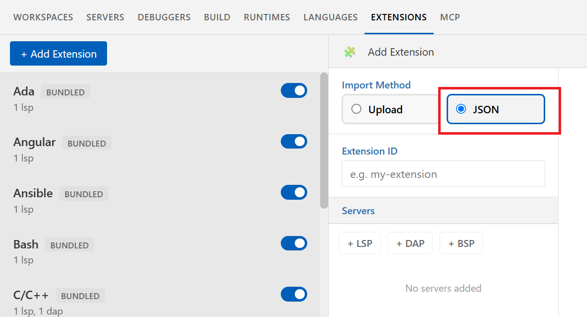

4. Click **+ LSP** and paste the following `server.json`:

```json
{
  "id": "intellij",
  "name": "IntelliJ Language Server",
  "description": "JetBrains IntelliJ Language Server",
  "readyNotification": "intellij/ready-for-test",
  "statusNotification": {
    "intellij/importLog": "message"
  },
  "documentSelector": [
    {
      "language": "java"
    }
  ],
  "command": {
    "windows": "${vscodeExtension:jetbrains.intellij-server}/server/bin/intellij-server.exe --stdio --eula YOUR_EULA_KEY",
    "default": "${vscodeExtension:jetbrains.intellij-server}/server/bin/intellij-server --stdio --eula YOUR_EULA_KEY"
  }
}
```

> **Important**: Replace `YOUR_EULA_KEY` with your own EULA acceptance key from the JetBrains license agreement.

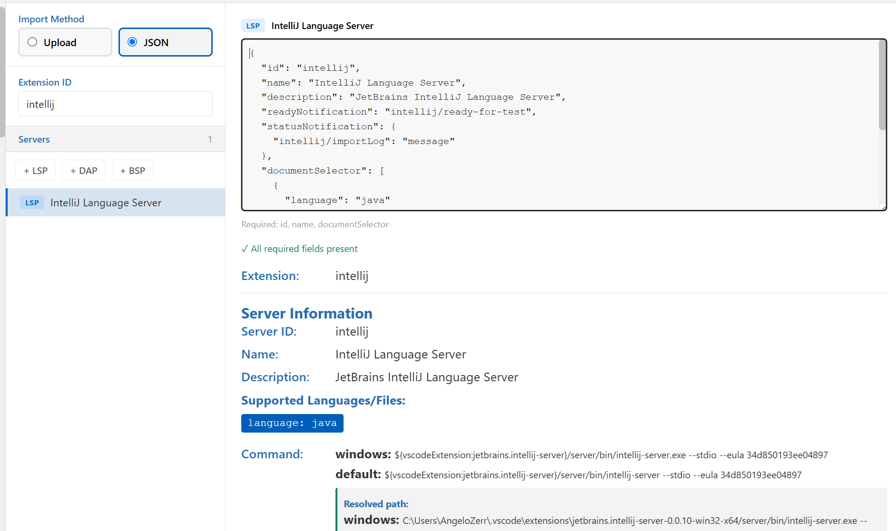

5. Click **Finish**

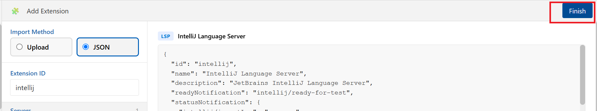

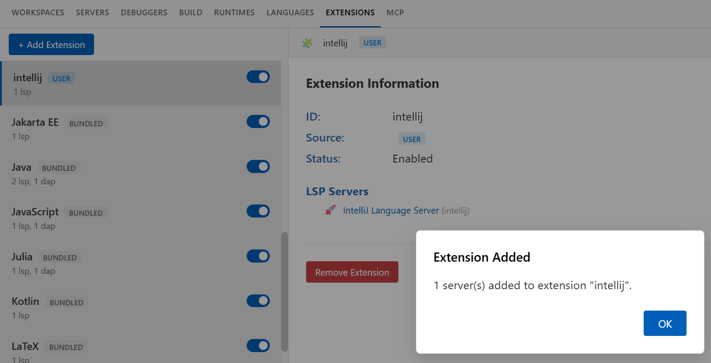

## Step 4: Enable Verbose Trace Level

Enable verbose traces for both LSP and MCP. The MCP Activity view requires these traces to be active.

**LSP traces**:
1. Go to the **SERVERS** tab > select **IntelliJ Language Server** > **SETTINGS** sub-tab
2. Set **Trace Level** to **verbose**

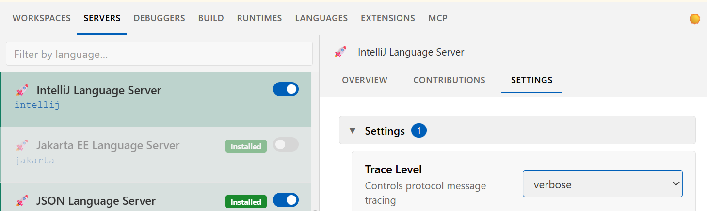

**MCP traces**:
1. Go to the **MCP** tab > **TRACES** sub-tab
2. Set the **Trace Level** combo (top right) to **verbose**

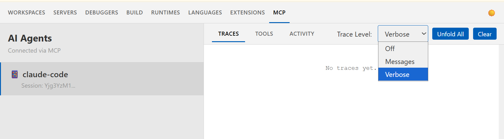

## Step 5: Disable the Java Extension (JDT.LS)

Both JDT.LS and IntelliJ handle Java files — disable JDT.LS to avoid conflicts:

1. In the **Extensions** tab, find the **Java** extension
2. Click the **Disable** toggle

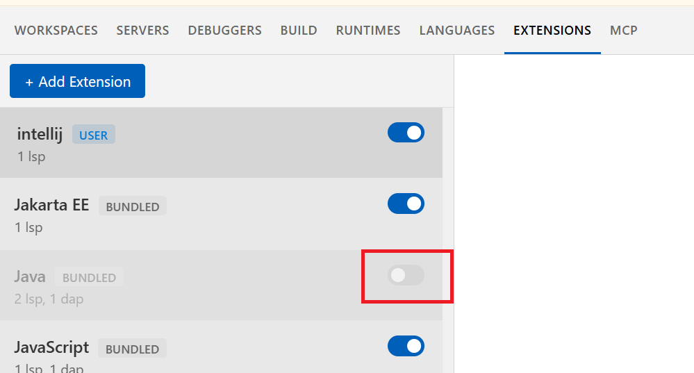

> **Tip**: You can re-enable JDT.LS at any time by toggling the extension back on.

## Step 6: Validate a Java File

Use a file with errors, e.g. `src/main/java/org/acme/App.java`:

```java
package org.acme;

public class App {

    public static void main(String[] args) {
        int x = "hello";
        System.out.println(y);
        List<String> list = new ArrayList<>();
    }
}
```

Ask the agent:

```
Could you validate App.java with lsp?
```

> **Important**: Use the keyword **"lsp"** so the agent uses `get_diagnostics` (routed to IntelliJ LS) instead of the `java_*` tools (which require JDT.LS).

Expected result:

```
Diagnostics for: App.java

Language Server: intellij (IntelliJ Language Server)
  [Error] Line 6: Incompatible types. Found: 'java.lang.String', required: 'int'
  [Error] Line 7: Cannot resolve symbol 'y'
  [Error] Line 8: Cannot resolve symbol 'List'
  [Error] Line 8: Cannot resolve symbol 'ArrayList'
```

## Step 7: Monitor in Admin UI

### Workspaces Tab

1. Select your workspace (e.g., `maven/microprofile-health-3`)
2. The **IntelliJ Language Server** shows its status: **Starting** > **Not Ready** > **Ready**
3. Click on the server to see the **TRACES** tab

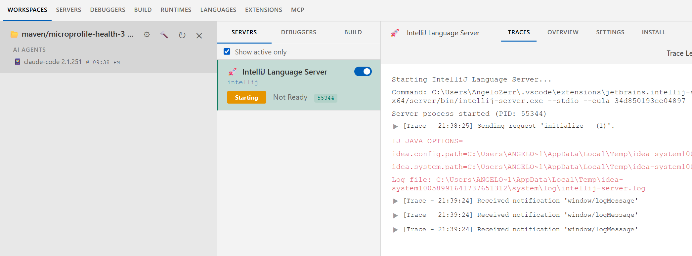

### MCP Traces

1. Go to the **MCP** tab > **TRACES** sub-tab

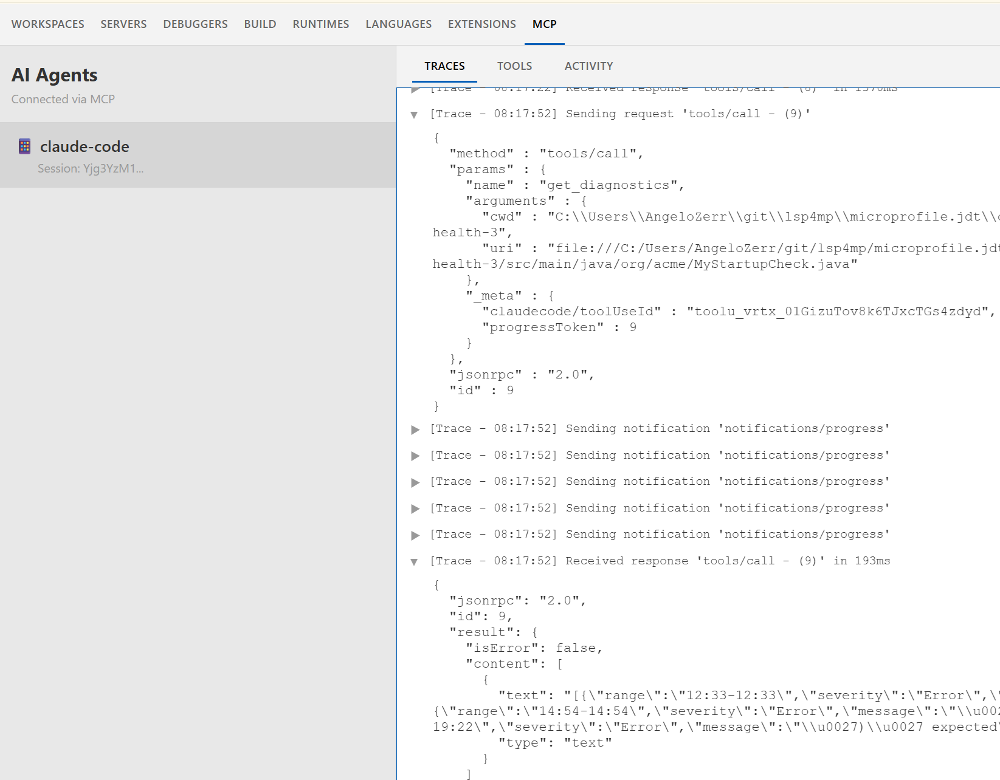

The traces show the raw MCP protocol: the `tools/call` request with `get_diagnostics` arguments, progress notifications, and the response with diagnostics (193ms).

### MCP Activity

1. Go to the **MCP** tab > **ACTIVITY** sub-tab

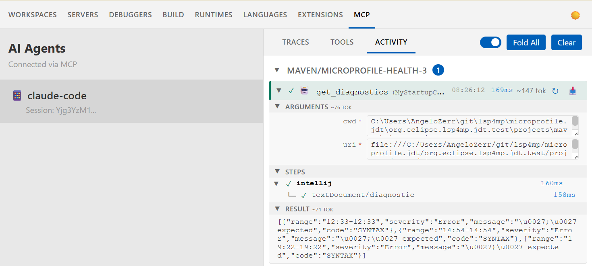

The Activity view shows:
- **ARGUMENTS**: `cwd` and `uri` sent by the agent
- **STEPS**: confirms **intellij** handled the request via `textDocument/diagnostic`
- **RESULT**: raw diagnostics JSON returned to the agent

## Next Steps

- **[Extension Guide](./extensions.md)** — Extension system in depth
- **[Admin UI Guide](./admin-ui.md)** — Full Admin UI reference
- **[Getting Started (DAP)](./getting-started-dap.md)** — Debug your code with breakpoints and stepping
